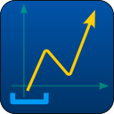
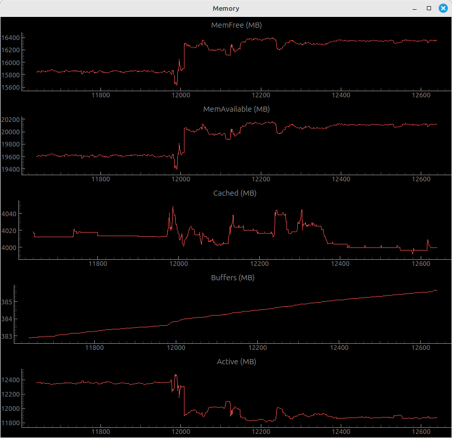

<p align="center">
  
</p>

<div style="text-align: center">

<h1>fplot</h1>

</div>


<!-- START doctoc generated TOC please keep comment here to allow auto update -->
<!-- DON'T EDIT THIS SECTION, INSTEAD RE-RUN doctoc TO UPDATE -->

- [About](#about)
- [Features](#features)
- [Requirements](#requirements)
  - [Runtime](#runtime)
  - [Development](#development)
- [Install](#install)
  - [Download](#download)
  - [Installation](#installation)
- [Freqlenty asked Questions](#freqlenty-asked-questions)
- [Links](#links)
- [Contribute](#contribute)
- [License](#license)
- [Some examples, remove after creation](#some-examples-remove-after-creation)
- [The largest heading](#the-largest-heading)
  - [The second largest heading](#the-second-largest-heading)
          - [The smallest heading](#the-smallest-heading)
  - [Tables](#tables)
  - [List](#list)
  - [Task list](#task-list)
  - [Colapsed section](#colapsed-section)
    - [We can hide anything, even code!](#we-can-hide-anything-even-code)
  - [Links](#links-1)

<!-- END doctoc generated TOC please keep comment here to allow auto update -->

## About

Fplot is a program for quick and easy visualization of realtime data from files in procfs and sysfs.

## Features

- Realtime graphical plots of data from files in /proc and /sys.
- Realtime plot of CPU load (--cpu)
- Realtime plot of process cpu usage (--pid)
- Average function
- Config file

## Requirements

Python3
PyQt6
pyqtgraph

## Install

### Download

```bash
git clone https://github.com/zonbrisad/fplot.git
```

### Installation

```bash
>apt install python3-pyqtgraph
```

or

```bash
>pip install pyqtgraph 
```

### Configuration

Add to directory to PATH or run:

```bash
>source fplot_init 
```

## Usage

### Option "--plot"

### Option "--plotrc"

### Option "--cpu"

### Option "--pid"

### Option "--conf"

Fplot supports plot configurations in json files.

```json
{
    "title": "Memory",
    "columns": 1,
    "interval": 1000,
    "datapoints": 1000,
    "plots": [
        {
            "file": "/proc/meminfo",
            "cmd": "",
            "row": "MemFree",
            "col": 2,
            "title": "MemFree (MB)",
            "divider": 1024
        },
        {
            "file": "/proc/meminfo",
            "cmd": "",
            "row": "MemAvailable",
            "col": 2,
            "title": "MemAvailable (MB)",
            "divider": 1024
        },
        {
            "file": "/proc/meminfo",
            "cmd": "",
            "row": "Cached",
            "col": 2,
            "title": "Cached (MB)",
            "divider": 1024
        },
        {
            "file": "/proc/meminfo",
            "cmd": "",
            "row": "Buffers",
            "col": 2,
            "title": "Buffers (MB)",
            "divider": 1024
        },
        {
            "file": "/proc/meminfo",
            "cmd": "",
            "row": "Active",
            "col": 2,
            "title": "Active (MB)",
            "divider": 1024
        }
    ]
}
```



## History

[HISTORY.md](/HISTORY.md)

## ToDo

- [x] change to timestamps as x axis
- [ ] HTML color name check
- [x] grid lines in plot
- [ ] multiple plots in a single plotwidget
- [x] icon
- [x] Colors
- [x] averaging
- [ ] save/recover data
- [ ] screenshot button
- [ ] pause button
- [ ] arithmetics
- [ ] counting
- [ ] integrating
- [ ] Add: option to generate template config file
- [ ] Add: Local directory for storage of userdefined config scripts ~/.config/fplot
- [x] Derived plots, plots based on other plots, downsampling, average, derivation
- [x] Ability to set fixed plot min/max limits
- [x] Invividual plot Titles


## Suggestions

- [ ] Support gpio
- [ ] Ability to read from remote files via ssh
- [ ] Automatic detection of file type
- [ ] Remove --plotcpu and replace it with --plot cpu
- [ ] Make a number of kernel data available as "files" via --plot
- [ ] Remove --plotpid and use --plot pid, --plot option will assume that a number is a pid
- [ ] Individual timer for all plots
- [ ] finding and marking min/max
- [ ] Ability to scroll large datasets

## Known issues
- Derived plot does not generate correct x axis timestamps

## Alternative plot parameter system

Current plot parameter system is position based.

Ex.
--plotrc FILE:ROW:COLUMN:DIVIDER:POINTS:FILTER@"Title"

To skip a parameter can be done by entering a ':' to get to the next parameter. This method works, but is error prone and somewhat impractical.

Ex:
--plotrc filename:2:3:::10@"Title"

An alternative solution could look something like this.
--plotrc FILE:RXX:CXX:DXX:PXX:FXX@"Title"

Each paramter value has a single letter prefix followed by a value. This means that paramters can be given in any order seen fit by the user. It also simplifies future enhancments.

 R - Row
 C - Column
 D - Divider
 M - Multiplier
 P - Datapoints
 F - Filter
 H - hostname
 U - username
 ymin - y axis minimum value
 ymax - y axis maximum value
 PC - plot color

 Alt.

 A - Average
 MA - Moving average

 ### Remote reading via ssh
  Using ssh to read values remotely would be a powerfull feature.
  The link below shows how it could be done.
  (https://stackoverflow.com/questions/10523642/is-there-scat-as-in-scp-etc-or-something-similar)
  The function would require a local key setup to function.

  --plots file:Hhostname:Uusername

## License
